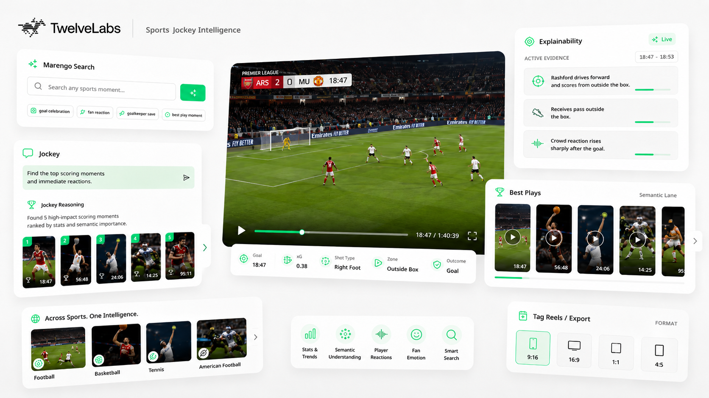

<h1 align="center">Sports Jockey Intelligence</h1>

<p align="center">
  
</p>

Search, analyze, and curate sports footage with TwelveLabs video understanding like a production workspace.

Sports Jockey combines Marengo semantic search, Pegasus 1.5 selected-clip analysis, and Jockey knowledge-store reasoning so producers can move from a long source video to grounded clips, entity evidence, tag reels, and saved metadata.

---

## Features

Everything needed for sports highlight discovery and editorial review -

**Semantic video discovery** - Search indexed source videos by meaning, not only by event-feed labels. Find plays, celebrations, pressure moments, crowd reactions, and atmosphere using Marengo search.

**Selected clip analysis** - Open a search result and analyze only that clip with Pegasus 1.5. The response is structured around tone tags, key action, score context, participants, producer tags, boundaries, and visual evidence.

**Workspace source review** - Review the active source video with playable TwelveLabs HLS streams, WSC-style baseline clips, and Jockey-curated semantic lanes for richer production decisions.

**Jockey semantic lanes** - Generate structured highlight categories such as best plays, emotional moments, fan experience, and behind the scenes moments from the knowledge store.

**Entity tracking** - Use Jockey to extract grounded teams, players, officials, fan groups, timestamped appearances, and entity-to-entity interactions from a source video.

**Tag reels** - Turn selected semantic moments into previewable reel candidates across formats such as 9:16, 16:9, 1:1, and 4:5.

**Jockey chat** - Ask for a reel, moment, or production angle in natural language and receive a grounded response with playable clip.

**Metadata memory** - Save selected clip analysis and Jockey chat turns back to the source video's TwelveLabs indexed asset metadata, so the workspace can reload saved context later.

---

## Tech Stack

### Frontend

React, TypeScript, Vite, Tailwind CSS, HLS.js

### Backend

Python, Flask, Gunicorn, APScheduler, Requests, TwelveLabs APIs

### TwelveLabs Capabilities

Marengo search, Pegasus 1.5 video analysis, Jockey `/responses`, knowledge stores, indexed asset playback, indexed asset `user_metadata`

---

### Who this is for

- **Sports producers** - Find the strongest moments in long-form footage without relying only on manually logged events.
- **Broadcast and clipping teams** - Compare event-feed baselines with semantic moments that capture emotion, momentum, and context.
- **Social editors** - Turn plays, reactions, celebrations, fan shots, and story beats into format-ready reels.
- **Rights and review teams** - Inspect timestamped evidence, participants, boundaries, and metadata before publishing.

---

## Local Setup

1. **Clone the repository**

```bash
git clone https://github.com/Hrishikesh332/Sports-Semantic-Jockey.git
cd Sports-Semantic-Jockey
```

1. **Set up the backend**

```bash
cd backend
python3 -m venv .venv
source .venv/bin/activate
pip install -r requirements.txt
cp .env.example .env
```

1. **Create `backend/.env`**

Add your TwelveLabs configuration:

```bash
TWELVELABS_API_KEY= "<Your TwelveLabs API KEY>"
INDEX_ID = "<Your TwelveLabs INDEX ID>"
PORT=5000
HIGHLIGHT_REEL_CACHE_ENABLED=true
```

1. **Run the backend**

```bash
cd backend
source .venv/bin/activate
python wsgi.py
```

The Flask API runs at `http://127.0.0.1:5000`.

1. **Set up the frontend**

In a new terminal from the repository root:

```bash
cd frontend
npm install
cp .env.example .env
```

1. **Create `frontend/demo/.env`**

```bash
VITE_API_BASE_URL="http://127.0.0.1:5000" or Deployed Backend URL
```

1. **Run the frontend**

```bash
cd frontend/demo
npm run dev
```

The frontend runs at `http://localhost:5173`.

---

## Workflow

1. **Register source footage** - Connect a source video to a TwelveLabs knowledge store, asset ID, and indexed video ID.
2. **Discover moments** - Use Marengo search to find semantically relevant clips across indexed source videos.
3. **Analyze a selected clip** - Run Pegasus 1.5 on only the selected search result for concise, grounded clip metadata.
4. **Open the source workspace** - Review the full source video, baseline event clips, and Jockey-curated semantic lanes.
5. **Inspect entities and interactions** - Use Jockey for  entity tracking to understand who appears, when they appear, and how entities interact.
6. **Create tag reels** - Preview and export candidate reels in social and recap formats.
7. **Save workspace memory** - Persist selected clip analysis and Jockey chat turns to indexed asset `user_metadata`.

---

## Metadata Stored on Indexed Assets

Dashboard and workspace analysis is stored on each source video's TwelveLabs indexed asset `user_metadata`.

| Metadata field | Purpose |
|---|---|
| `sports_jockey_highlight_reels_v1` | Cached Jockey highlight reels for the Dashboard |
| `sports_jockey_highlight_reels_summary_v1` | Summary for cached reels, including clip counts and generation time |
| `sports_jockey_entity_tracking_v1` | Cached Jockey entity tracking manifest |
| `sports_jockey_entity_tracking_summary_v1` | Summary for entity counts and generation time |
| `sports_jockey_workspace_v1` | Saved selected-clip analyses and Jockey chat turns |
| `sports_jockey_workspace_summary_v1` | Saved workspace item counts by kind |

The backend resolves `video_name` to a registered asset, reads the matching indexed asset under `INDEX_ID`, checks cached metadata, and only calls Pegasus or Jockey when fresh analysis is needed.

---

## Core Use Cases

- **Highlight discovery beyond the event feed** - Find emotional and visual moments that traditional sports data may not describe.
- **Search-to-analysis workflows** - Move from a Marengo result to a Pegasus 1.5 clip response without analyzing the whole video first.
- **Source video intelligence** - Turn full-match footage into semantic lanes, grounded entity evidence, and production-ready summaries.
- **Social reel production** - Generate candidate clips for vertical, square, and recap formats.
- **Editorial memory** - Save useful clip analysis and Jockey chat turns directly on the indexed source video metadata.

---

## API Reference

Base URL examples

```text
http://127.0.0.1:5000
```

Primary app facing routes -

| Method | Path | Purpose |
|---|---|---|
| `GET` | `/health` | Backend health check |
| `GET` | `/games` | List registered games/workspaces |
| `POST` | `/games` | Register a game/workspace |
| `GET` | `/games/<tag>/index-videos` | List indexed videos and metadata flags |
| `GET` | `/games/<tag>/discover-videos` | List videos ready for Discover playback |
| `POST` | `/games/<tag>/search` | Run Marengo semantic search |
| `POST` | `/games/<tag>/clip-analysis` | Run Pegasus 1.5 analysis on a selected clip |
| `POST` | `/games/<tag>/highlight-reels` | Generate or read Jockey Dashboard reels |
| `POST` | `/games/<tag>/entity-tracking` | Generate or read Jockey entity tracking |
| `POST` | `/games/<tag>/jockey-chat` | Ask Jockey for grounded answers or clip manifests |
| `GET` | `/games/<tag>/videos/<video_name>/jockey-workspace` | Read saved workspace metadata |
| `POST` | `/games/<tag>/videos/<video_name>/jockey-workspace/saved-clip-analysis` | Save selected clip analysis |
| `POST` | `/games/<tag>/jockey-workspace/saved-jockey-turn` | Save a Jockey chat turn |

---

## Repository Structure

```text
backend/
  app/
    api/routes/          Flask routes for assets, games, search, analysis, and Jockey flows
    core/                Config, CORS, errors, environment loading, keep-alive
    domain/highlights/   Highlight schemas, prompts, and parsing helpers
    integrations/        TwelveLabs HTTP client
    services/            Ingestion, games, highlights, and metadata use cases
  data/                 
  scripts/               Upload, warm metadata, smoke test, and maintenance scripts
  wsgi.py                Backend entrypoint
```


---

## Queries

For any doubts or help, you can reach out via `hrishikesh3321@gmail.com`.
